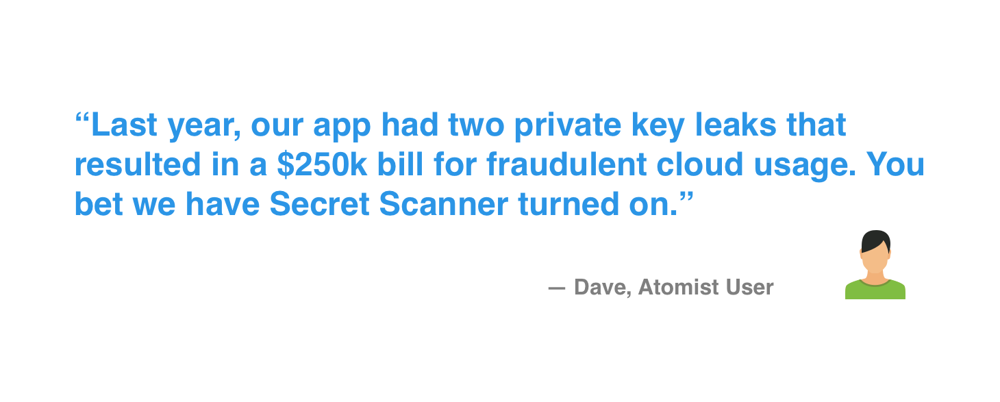
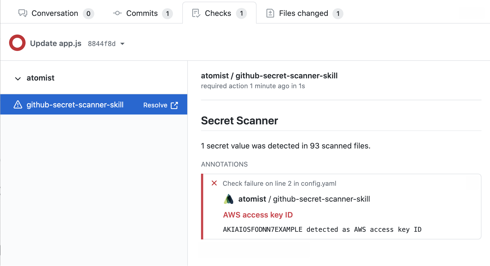
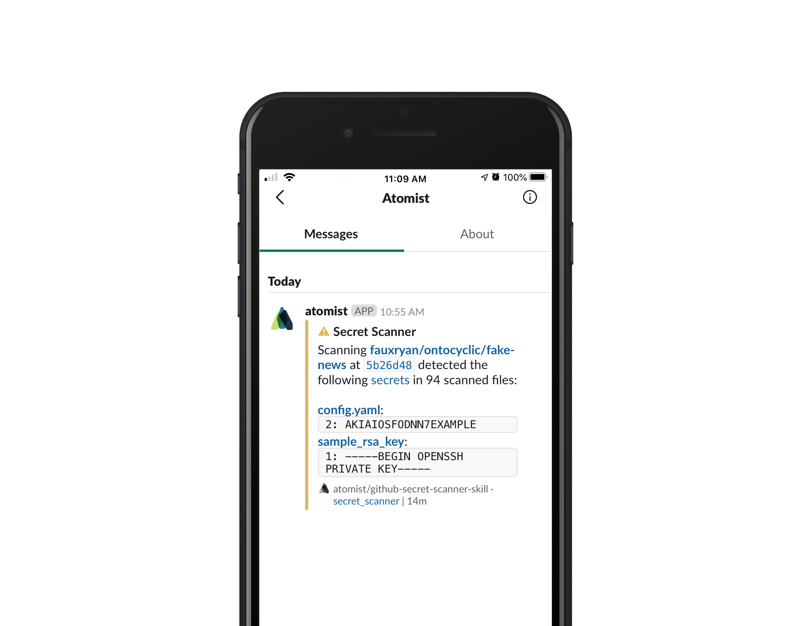
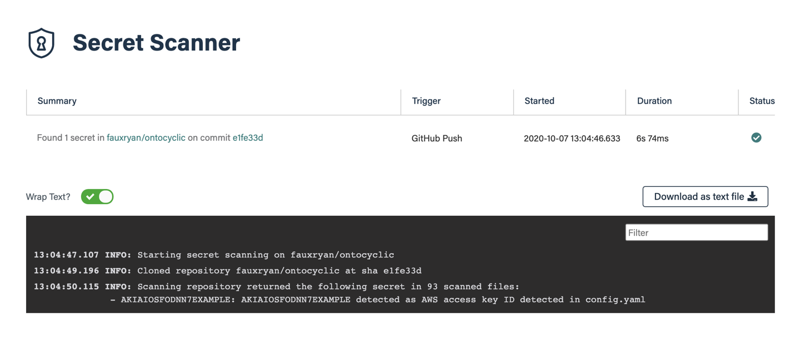
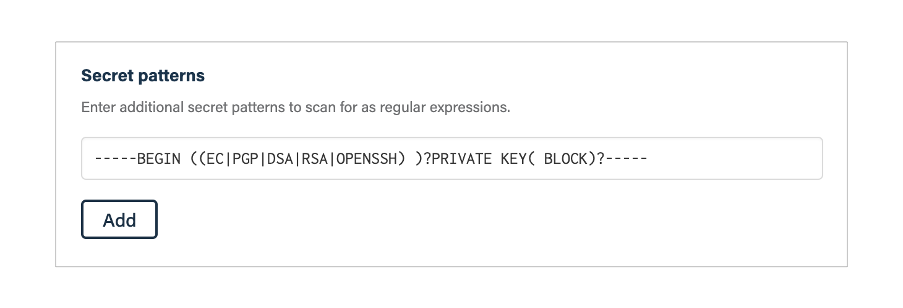
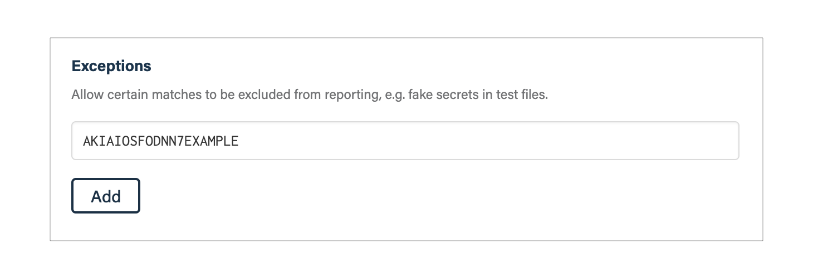

## What it's useful for

Prevent leaking API keys, access tokens, passwords and other sensitive data by
keeping them out of your codebase. Secret Scanner detects and alerts you when
secrets are committed in your code and configuration in a GitHub repository. It
helps prevent secrets from being exposed by adding a failed GitHub Check when a
secret is detected.

Secret Scanner automatically scans for access and API keys for Twitter,
Facebook, Google, Stripe, Square, PayPal, AWS, Twilio, Mailchimp, Mailgun and
Picatic API. Secret Scanner supports adding patterns to detect other secrets not
detected by default. Add scanning support for other tools with a simple regular
expression.

-   Flag code and configuration with secrets so that they do not get deployed
-   Supports the most common cloud provider services
-   Add your own secret patterns
-   Manage exceptions to ignore secrets like sample keys
-   Control exactly which secrets to scan for and which files to scan

### Flag code with secrets by adding GitHub Checks

### Notify committer when secrets are detected

### See the full history of all scans in the log

### Add new secret patterns to scan for

### Keep track of exceptions so that sample secrets don't block you

