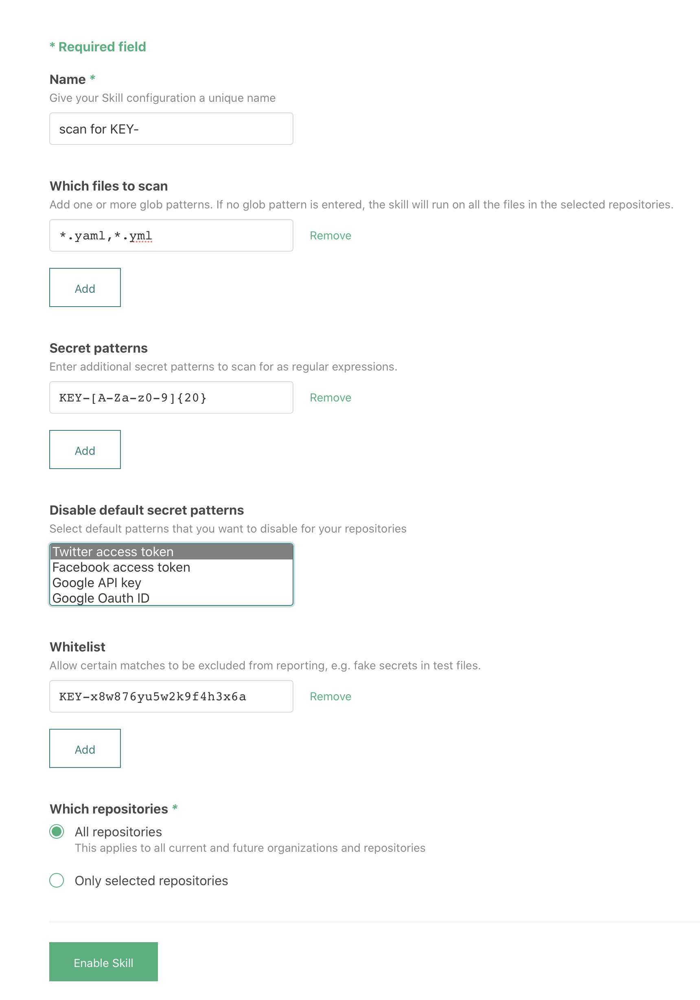

# `atomist/github-secret-scanner-skill`
 
<!---atomist-skill-readme:start--->

# What it's useful for

This skill detects common secrets and creates GitHub Checks to indicate whether a push contained undesired secrets. 

It also supports adding patterns to detect other secrets not detected by default by this skill.

# Before you get started

Connect and configure these integration:

1. **GitHub**

The **GitHub** integration must be configured in order to use this skill. At least one repository must be selected. 

# How to configure

1. **Select the files to scan**
    
    To restrict the files that this skill will run on, provide one or more glob patterns. 
    For example, to only run on YAML files with `.yaml` or `.yml` extensions at any depth in the repository, 
    you could provide this glob pattern:
    
    `*.yaml,*.yml`
    
    
    
    For more information on glob patterns, see [the wikipedia page](https://en.wikipedia.org/wiki/Glob_(programming)).

2. **Add additional secret pattern to scan for**

    To scan for other secrets, add regular expressions that match your secret format. For example, to match a secret 
    format like `KEY-x8w876yu5w2k9f4h3x6a`, which is the string `KEY-` followed by exactly twenty alphanumeric 
    characters, this regular expression will do the job:
    
    `KEY-[A-Za-z0-9]{20}`
    
     
    
    For help crafting and testing your regular expressions, try [this online tool](https://regex101.com/) and see 
    [this guide](https://developer.mozilla.org/en-US/docs/Web/JavaScript/Guide/Regular_Expressions/Cheatsheet).

3. **Disable any default patterns** 

    Some times scanning via regular expression can yield false positives. Therefore, it can make sense to disable
    any number of default patterns that are built into this skill.
    
    This skill automatically scans for these secrets:
     
     - Twitter access token
     - Facebook access token
     - Google API key 
     - Google Oauth ID 
     - Picatic API Key
     - Stripe regular API key
     - Stripe restricted API key
     - Square access token
     - Square Oauth Secret
     - PayPal Braintree access token
     - Amazon MWS auth token
     - Twilio API key
     - MailGun API key
     - MailChimp API key
     - AWS access key ID
     
    Selecting any number of secrets here, will disable scanning for these. 

4. **Add secret values to whitelist**

    Frequently secret values are used in test resources and don't represent leaked credentials. 
    
    Use the whitelist to enter such secret values to ignore those during reporting.
    
     

5. **Determine repository scope**

    

    By default, this skill will be enabled for all repositories in all organizations you have connected.

    To restrict the organizations or specific repositories on which the skill will run, you can explicitly choose 
    organization(s) and repositories.

# How to use secret-scanning

1. **Configure the skill, set file glob patterns, additional regular expressions and whitelist values** 

    

2. **Every time you push to a repository, Secret Scanner will scan and report detected secrets in a GitHub Check**

    

3. **Don't risk letting sensitive secrets and credential sit in your code base for the taking!**

To create feature requests or bug reports, create an [issue in the repository for this skill](https://github.com/atomist-skills/github-secret-scanner-skill/issues). 
See the [code](https://github.com/atomist-skills/github-secret-scanner-skill) for the skill.

<!---atomist-skill-readme:end--->

---

Created by [Atomist][atomist].
Need Help?  [Join our Slack workspace][slack].

[atomist]: https://atomist.com/ (Atomist - How Teams Deliver Software)
[slack]: https://join.atomist.com/ (Atomist Community Slack) 
