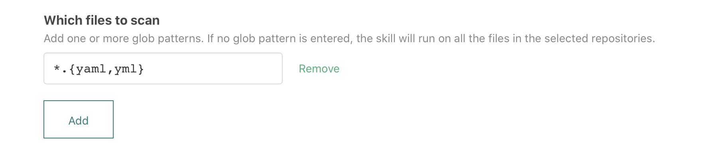

# `atomist/github-secret-scanner-skill`

<!---atomist-skill-description:start--->

Scan committed code for well-known credentials and secrets

<!---atomist-skill-description:end--->

<!---atomist-skill-readme:start--->

# What it's useful for

This skill detects common secrets and creates GitHub Checks to indicate whether a push contained undesired secrets.

It also supports adding patterns to detect other secrets not detected by default by this skill.

# Before you get started

Connect and configure this integration:

-   **GitHub**
-   **Slack or Microsoft Teams**

The **GitHub** integration must be configured in order to use this skill. At least one repository must be selected.
We recommend that you configure the **Slack** or **Microsoft Teams** integration to get actionable notifications
right in chat when this skill detects secrets in your repositories.

# How to configure

1. **Select the files to scan**

    To restrict the files that this skill will run on, provide one or more [glob patterns](<https://en.wikipedia.org/wiki/Glob_(programming)>).
    For example, to only run on YAML files with `.yaml` or `.yml` extensions at any depth in the repository,
    you would provide this glob pattern:

    `*.{yaml,yml}`

    

2. **Add additional secret patterns**

    To scan for other secrets, add regular expressions that match your secret format. For example, to match a secret
    format like `KEY-x8w876yu5w2k9f4h3x6a`, which is the string `KEY-` followed by exactly twenty alphanumeric
    characters, this regular expression will do the job:

    `KEY-[A-Za-z0-9]{20}`

    

    For help crafting and testing your regular expressions, try [this online tool](https://regex101.com/) and see
    [this guide](https://developer.mozilla.org/en-US/docs/Web/JavaScript/Guide/Regular_Expressions/Cheatsheet).

3. **Disable secret patterns**

    You can disable specific secret patterns. We recommend scanning for as many known secrets as possible. Scanning via regular expression can sometimes yield false positives, however. Disable a secret pattern to avoid false positives for secret types not present in your code base.

    This skill automatically scans for these secrets:

    - Twitter access token
    - Facebook access token
    - Google API key
    - Google Oauth ID
    - Picatic API Key
    - Stripe regular API key
    - Stripe restricted API key
    - Square access token
    - Square Oauth Secret
    - PayPal Braintree access token
    - Amazon MWS auth token
    - Twilio API key
    - MailGun API key
    - MailChimp API key
    - AWS access key ID

    Selecting any number of secrets will disable scanning for those secrets.

4. **Add secret values to exceptions**

    Frequently secret values are used in testing and don't represent leaked credentials. Use exceptions to enter secret
    values to ignore during reporting. You may also use the exceptions to identify false positives to ignore.

    

5. **Determine repository scope**

    

    By default, this skill will be enabled for all repositories in all organizations you have connected.

    To restrict the organizations or specific repositories on which the skill will run, you can explicitly choose
    organization(s) and repositories.

# How to use secret-scanning

1. **Configure the skill, set file glob patterns, additional regular expressions and exceptions**

2. **Every time you push to a repository, Secret Scanner will scan and report detected secrets in a GitHub Check**

    

    If you have the **Slack** integration configured as well as a chat channel linked to your repository, you'll get
    the following message informing you about detected secrets. Using the menus you can add a detected secret to the
    exceptions or ignore an entire file.

    

3. **Don't risk letting sensitive secrets and credential sit in your code base for the taking!**

To create feature requests or bug reports, create an [issue in the repository for this skill](https://github.com/atomist-skills/github-secret-scanner-skill/issues).
See the [code](https://github.com/atomist-skills/github-secret-scanner-skill) for the skill.

<!---atomist-skill-readme:end--->

---

Created by [Atomist][atomist].
Need Help? [Join our Slack workspace][slack].

[atomist]: https://atomist.com/ "Atomist - How Teams Deliver Software"
[slack]: https://join.atomist.com/ "Atomist Community Slack"
 
